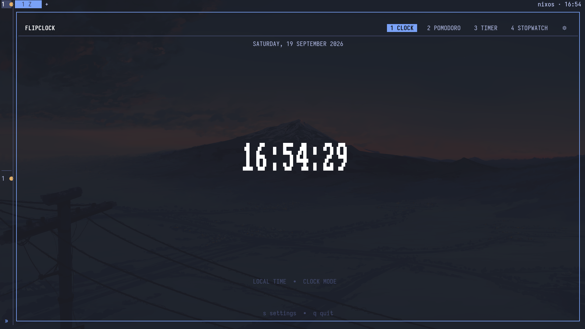

# ClockTUI

A minimal terminal clock with pomodoro timers, a countdown timer, and a
stopwatch — built in Rust with [ratatui](https://ratatui.rs/).



## Modes

| Key | Mode |
|-----|------|
| `1` | Clock (standard local time, default) |
| `2` | Pomodoro (focus / short break / long break cycles) |
| `3` | Timer (countdown — type the length directly) |
| `4` | Stopwatch (with laps) |

`Tab` / `Shift-Tab` cycles modes. Everything is clickable with the mouse.

## Keys

| Key | Action |
|-----|--------|
| `Space` | Start / pause |
| `R` | Reset |
| `S` | Skip pomodoro phase (`s` also works in pomodoro mode) |
| `L` | Lap (stopwatch) |
| `E` | Type a timer length (`MM:SS`, `HH:MM:SS`, `25`, `25m`, `90s`, `2h`, …), `Enter` saves, `Esc` cancels |
| `T` / `[` / `]` | Cycle theme |
| `B` | Toggle transparent background (inherit terminal background + opacity) |
| `M` | Toggle mouse support |
| `S` / `?` / `F1` | Settings |
| `Q` / `Esc` | Quit |

## Settings (`S`)

- **DISPLAY** — theme, transparent background, 24-hour clock, seconds
- **POMODORO-SPECIFIC** — focus / short break / long break lengths, sessions
  before a long break, auto-start breaks / focus

Themes: System (inherits your terminal theme), Everforest, Catppuccin Mocha,
Tokyonight Night, Gruvbox Dark, Rosé Pine, Terafox.

Pomodoro and timer start / pause / finish events send a desktop notification
over Freedesktop D-Bus.

## Install

### Nix flake (recommended)

```bash
nix run github:Leabua/ClockTUI
```

Or pin it in your NixOS config — input:

```nix
clocktui = {
  url = "github:Leabua/ClockTUI";
  inputs.nixpkgs.follows = "nixpkgs";
};
```

package (`environment.systemPackages`):

```nix
inputs.clocktui.packages."${pkgs.stdenv.hostPlatform.system}".default
```

then `sudo nixos-rebuild switch --flake ~/dotfiles/nixos#nixos`.
Removing those two lines and rebuilding uninstalls it completely.

### Cargo

```bash
cargo install --path .
```

## License

MIT — see [LICENSE](LICENSE).
